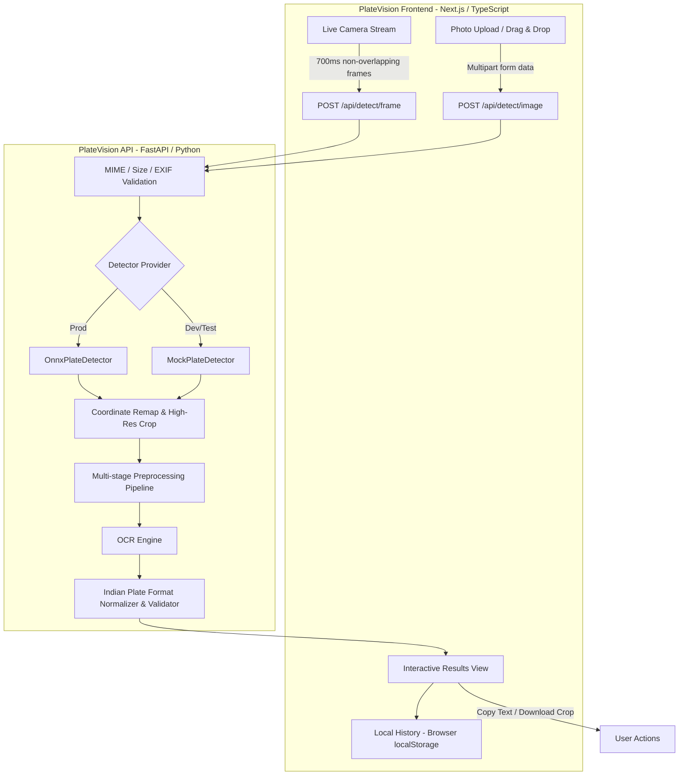

# PlateVision 🚗🔍

> **Production-Quality, Mobile-First Vehicle Number Plate Detection, Cropping & OCR System**

PlateVision is a real-time, privacy-first computer-vision web application designed to detect and recognize vehicle registration plates from live phone camera feeds, direct captures, and image uploads. Built with a specialized position-aware normalizer for Indian High Security Registration Plates (HSRP) and international formats.

---

## 🌟 Key Capabilities

- **📱 Live Phone Camera Scanning**: Real-time `getUserMedia` environment camera feed with non-overlapping 700ms inference frames, live laser HUD overlay, front/rear camera switcher, torch/flash, and optical zoom.
- **⚡ High-Resolution Plate Cropping**: Automatically expands bounding boxes by a configurable padding margin, clamps boundaries within image limits, and extracts crops directly from original-resolution images.
- **🧠 Multi-Variant OCR Pipeline**: Evaluates crops against 4 adaptive preprocessing pipelines (Grayscale CLAHE + Otsu thresholding, Bilateral Denoising, Morphological Top-Hat/Sharpening, and Bicubic Super-Resolution) to select optimal character recognition scores.
- **🇮🇳 Indian Number Plate Normalization**: Position-aware OCR character disambiguation (`O/0`, `I/1`, `B/8`, `S/5`, `Z/2`, `G/6`, `A/4`) supporting standard state formats (`GJ01AB1234`, `DL01CA1234`, `MH12DE1433`) and Bharat Series (`22BH1234AA`).
- **🔒 Privacy & Zero-Retention Security**: Operates 100% in-memory with transient caches (5-minute TTL). Zero server disk storage, zero permanent image logging, plate text redacted in server logs, and client-side only local history.
- **📊 Interactive Results Canvas**: Real-time bounding box projection, confidence score badges (detection vs OCR), one-click copy, crop image download, in-place text correction, and filter comparison inspector.

---

## 🏗️ Architecture



---

## 📁 Repository Structure

```
platevision/
├── backend/
│   ├── app/
│   │   ├── api/
│   │   │   ├── endpoints/
│   │   │   │   ├── detect.py      # /api/detect/image & /api/detect/frame
│   │   │   │   ├── health.py      # /api/health
│   │   │   │   └── results.py     # /api/results/.../crop
│   │   │   └── router.py
│   │   ├── core/
│   │   │   ├── config.py          # Pydantic Settings
│   │   │   ├── logging.py         # Privacy-redacted logging
│   │   │   └── security.py        # Security headers & rate limiter
│   │   ├── schemas/
│   │   │   └── detection.py       # Pydantic models
│   │   ├── services/
│   │   │   ├── crop_store.py      # Transient in-memory TTL cache
│   │   │   ├── cropper.py         # Padding, clamping & crop extraction
│   │   │   ├── normalizer.py      # Position-aware Indian character correction
│   │   │   ├── validator.py       # Indian RTO state & BH regex validation
│   │   │   ├── detector/          # Provider architecture
│   │   │   │   ├── base.py
│   │   │   │   ├── factory.py
│   │   │   │   ├── mock_detector.py
│   │   │   │   └── onnx_detector.py
│   │   │   └── ocr/
│   │   │       ├── engine.py
│   │   │       └── preprocessor.py
│   │   ├── utils/
│   │   │   └── image_ops.py
│   │   └── main.py
│   ├── tests/
│   ├── Dockerfile
│   └── requirements.txt
├── frontend/
│   ├── app/
│   │   ├── camera/page.tsx        # Live camera scanner
│   │   ├── upload/page.tsx        # Drag & drop photo upload
│   │   ├── history/page.tsx       # Local scan history
│   │   ├── about/page.tsx         # About & format guide
│   │   ├── layout.tsx
│   │   └── page.tsx               # Dashboard
│   ├── components/
│   │   ├── camera/
│   │   ├── upload/
│   │   ├── results/
│   │   ├── history/
│   │   ├── common/
│   │   └── ui/
│   ├── hooks/
│   │   ├── useCamera.ts
│   │   ├── useLiveDetection.ts
│   │   └── useLocalHistory.ts
│   ├── lib/
│   ├── tests/
│   ├── Dockerfile
│   └── package.json
├── models/
│   └── README.md
├── scripts/
│   ├── setup_models.py
│   ├── run_dev.bat
│   └── run_dev.sh
├── docker-compose.yml
├── .env.example
└── README.md
```

---

## 🚀 Quick Start (Local Development)

### 1. Prerequisites
- **Node.js**: `v18.0.0` or higher
- **Python**: `3.10` or higher
- **Git**

### 2. Backend Setup
```bash
cd backend

# Create and activate virtual environment
python -m venv .venv
# On Windows:
.venv\Scripts\activate
# On macOS/Linux:
source .venv/bin/activate

# Install dependencies
pip install -r requirements.txt

# Start FastAPI server
uvicorn app.main:app --reload --host 0.0.0.0 --port 8000
```
Backend will be live at `http://localhost:8000`. Interactive OpenAPI documentation is accessible at `http://localhost:8000/api/docs`.

### 3. Frontend Setup
```bash
cd frontend

# Install dependencies
npm install

# Start Next.js development server
npm run dev
```
Frontend will be live at `http://localhost:3000`.

---

## 🐳 Docker Deployment

To launch the full system via Docker Compose:

```bash
docker-compose up --build -d
```

- Frontend: `http://localhost:3000`
- Backend API: `http://localhost:8000/api/health`

---

## 📱 Mobile Camera Access & HTTPS

Modern mobile browsers (Chrome on Android, Safari on iOS) require a **Secure Context (HTTPS or localhost)** to access `navigator.mediaDevices.getUserMedia`.

### Testing on your Phone across Local Wi-Fi:
1. Find your machine's local IP address (e.g. `192.168.1.15`).
2. Run backend and frontend binding to `0.0.0.0`:
   ```bash
   # In frontend, run with host 0.0.0.0:
   npm run dev -- -H 0.0.0.0
   ```
3. Use Chrome's secure origin flag for local testing:
   - On Android Chrome, open `chrome://flags/#unsafely-treat-insecure-origin-as-secure`
   - Add `http://192.168.1.15:3000` and enable the flag.
   - Restart Chrome on phone and navigate to `http://192.168.1.15:3000/camera`.
4. In production, deploy behind an SSL reverse proxy (e.g., Caddy, Nginx with Let's Encrypt, or Cloudflare).

---

## 🧪 Testing

### Backend Test Suite (Pytest)
```bash
cd backend
pytest -v
```
Includes tests for:
- Bounding-box padding & boundary clamping math
- Normalized-to-pixel coordinate conversions
- Position-aware Indian plate OCR character normalization (`O/0`, `I/1`, `B/8`, etc.)
- Standard State & Bharat Series format validation
- File validation, oversized payload rejection, and safe image decoding
- API endpoint integration (`/health`, `/detect/image`, `/detect/frame`, `/results/.../crop`)

### Frontend Test Suite (Vitest)
```bash
cd frontend
npm run test
```

### Production Build Verification
```bash
cd frontend
npm run build
```

---

## 🔒 Privacy & Responsible Use

> **Notice:** Vehicle registration numbers may be personal or sensitive information. Scan only vehicles you are authorized to process.

- **No Permanent Server Storage**: Images and crop buffers are held in a short-lived transient cache with 5-minute TTL.
- **Redacted Logging**: Plate registration characters are automatically masked in console/system logs (e.g. `GJ01****34`).
- **No Surveillance**: Contains no vehicle-owner lookup, tracking, surveillance, facial recognition, or centralized database.
