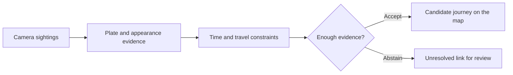

# Drishti Grid · PlateVision

[](https://github.com/tirthp008-alt/platevision/actions/workflows/ci.yml)

**Multi-camera vehicle journeys, plate recognition, and traffic review.**

Drishti Grid combines plate readings, vehicle appearance, capture time, and travel feasibility to suggest links between camera sightings. Its map keeps observations, inferred movement, and unresolved candidates distinct. PlateVision provides the image and video analysis tools beneath the web application.

This is an independent prototype. It does not claim government affiliation, production readiness, or verified vehicle identity.

[Start locally](docs/SETUP.md) · [Judge walkthrough](docs/DEMO.md) · [Architecture](docs/ARCHITECTURE.md) · [Measured results](docs/EVALUATION.md)

## Two ways to explore

| Experience | What to try | Local address |
|---|---|---|
| **Drishti Grid** | Register cameras, inspect annotated snapshots, search plate sightings, review route evidence and traffic summaries | `http://localhost:3000/grid` |
| **PlateVision desktop console** | Analyse photos or recordings, compare model checkpoints, inspect OCR evidence, export annotated MP4 | `http://127.0.0.1:8080` |

The applications have separate APIs and configurations. The console measurements below do **not** measure Drishti Grid's cross-camera accuracy or dashboard latency.


```mermaid
flowchart LR
    A[Camera sightings] --> B[Plate and appearance evidence]
    B --> C[Time and travel constraints]
    C --> D{Enough evidence?}
    D -->|Accept| E[Candidate journey on the map]
    D -->|Abstain| F[Unresolved link for review]
```

## What is implemented

- **Camera operations:** local devices, RTSP/files, feed probing, per-camera processing status, and annotated JPEG snapshots.
- **Journey review:** local tracking, configurable cross-camera fusion, a map and timeline, and explicit abstention when evidence is insufficient.
- **Traffic summaries:** segment flow, estimated speed, congestion indicators, and camera heatmaps. These estimates are not a validated city traffic census.
- **Review controls:** Grid roles, masked plate text for viewers, and audit records for sensitive operations. No vehicle-owner lookup is included.
- **Desktop evidence:** OCR-independent plate boxes, original and corrected crops, bounded retries for uncertain readings, vehicle-category review flags, and annotated recording exports.

Grid's five-camera demo renders synthetic scenes and processes them through the configured pipeline. Detector, OCR, and appearance backends may use fallbacks; check system status and startup logs before describing a run as model inference.

## Latest model evaluation

A YOLO11n candidate completed **20 additional fine-tuning epochs** using the supplied ZIP datasets. It improves validation localization but regresses on the reserved test and manual OCR diagnostic, so **green YOLOv8n remains the recommended console model**. Both checkpoints are available in the [versioned model release](https://github.com/tirthp008-alt/platevision/releases/tag/v2026.09.28-models).

| Desktop-console measure | Recommended green YOLOv8n | YOLO11n candidate |
|---|---:|---:|
| Whole-image validation plates matched | 99/131 | 111/131 |
| Reserved-test plates matched | 22/28 | 21/28 |
| Manual raw OCR exact, including detection misses | 6/12 | 5/12 |
| Manual application-normalized exact | 9/12 | 7/12 |
| Synthetic plate boxes per image | 10/10 | 10/10 |

Localization uses IoU ≥ 0.5. The manual subset is purposive and the reserved test has been used before; neither establishes independent road accuracy. Raw OCR and application-normalized text are scored separately. Both models passed a **120-frame annotated video export check**. Overall 95% plate recall and a sub-40 ms complete result have **not** been established.

See [methodology, latency, model hashes, and limitations](docs/EVALUATION.md). Drishti Grid's end-to-end association accuracy remains unmeasured.

## Run it

Use Python 3.12 and Node.js 20+ for the web application. The console needs Python only; an Intel GPU is optional. Follow the [clean-install instructions](docs/SETUP.md) for separate environments and ports.

After installing the console requirements, these commands run the recommended model with the shared OCR and vehicle pipeline:

```bash
python scripts/setup_demo_models.py --bundle core
python scripts/run_console.py --model recommended
```

To review the trained candidate, stop that console and run `python scripts/run_console.py --model yolo11n`. The launcher prints its URL. Model installation verifies hashes; model files and private datasets are not stored in Git.

## Repository guide

| Path | Purpose |
|---|---|
| [`backend/`](backend/) | PlateVision API and Drishti Grid subsystem |
| [`frontend/`](frontend/) | Next.js application and `/grid` dashboard |
| [`desktop-console/`](desktop-console/README.md) | Independent plate/OCR and recording console |
| [`models/`](models/README.md) | Model metadata and installation guidance |
| [`docs/`](docs/SETUP.md) | Setup, demo, architecture, configuration, and evaluation |
| [`DRISHTI_GRID.md`](DRISHTI_GRID.md) | Detailed Grid module, API, and database reference |

Current setup instructions are in `docs/SETUP.md`; use them in preference to older commands or benchmark statements in historical references.

## Validation and next steps

Run the backend, frontend, and console checks described in [Setup → Checks](docs/SETUP.md#checks). The suites cover fusion/abstention, trajectory ordering, API permissions, retained uncertain regions, OCR evidence, and recording behavior. Test passes are not accuracy measurements.

The next evaluation needs independently labelled camera recordings, exact readable plate transcripts, and cross-camera identity ground truth. Watchlist alerts and origin–destination matrices are not implemented. Use synthetic or authorized inputs; keep registrations, raw footage, credentials, and local runtime exports out of public repository artifacts.
