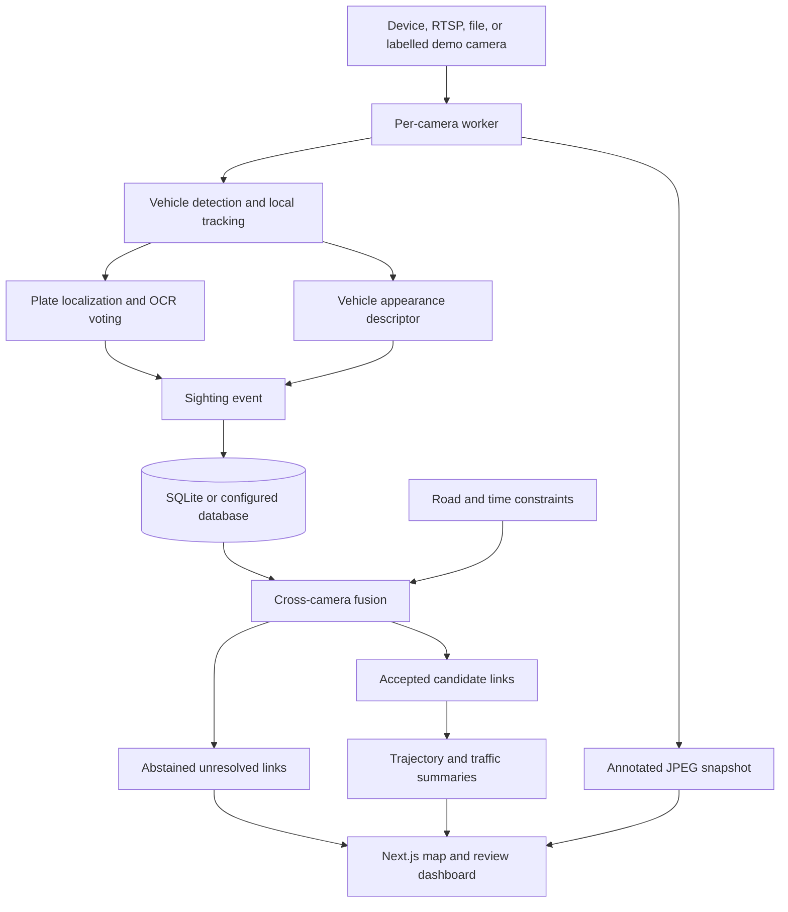
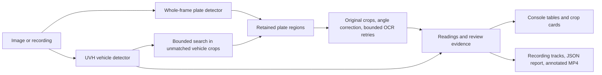

# Architecture

[Overview](../README.md) · [Setup](SETUP.md) · [Grid reference](../DRISHTI_GRID.md)

This repository contains two independent applications. They share a plate-analysis purpose and model artifacts, but have different inference implementations and API contracts. Performance measured in one must not be attributed to the other.

## Drishti Grid and the PlateVision web app

The primary API is in `backend/`; Grid lives in `backend/app/grid/` and is mounted at `/api/grid`. The Next.js dashboard is `frontend/app/grid/page.tsx`. PlateVision's upload, camera, CCTV, crop, and result pages remain available.

| Component | Responsibility |
|---|---|
| `camera_manager.py`, `pipeline.py` | Camera workers, frame processing, and sighting creation |
| `vehicle_detector.py`, `local_tracker.py` | Vehicle proposals and per-camera track IDs |
| `plate_localizer.py`, `plate_ocr.py` | Plate crops, OCR readings, and observation voting |
| `embedder.py` | Classical appearance descriptors or a configured ONNX embedding model |
| `fusion.py`, `trajectory.py` | Candidate links, confidence gate, path assembly, and plate search |
| `road_network.py`, `analytics.py` | Travel estimates, road geometry, and traffic summaries |
| `models.py`, `repository.py`, `db.py` | Sightings, observations, identities, transitions, and persistence |
| `privacy.py`, `events.py`, `metrics.py` | Roles, audit support, event delivery, and instrumentation |

### Association rules

The fusion score combines plate agreement, visual similarity, and a travel-time penalty. The best candidate must pass both the configured score threshold and the margin over the second-best candidate. The weights and thresholds are settings-driven; `plate_only`, `plate_visual`, and `full` are comparison modes. These scores are not calibrated identity probabilities.

Accepted links form a simple path with distinct cameras and increasing time. `ABSTAINED` links are unresolved questions; `REJECTED` links are not. Fusion rebuilds identities over the recent-sighting window while retaining sightings. Identity IDs derive from the earliest sighting, and plate search prefers exact matches with stronger multi-camera paths.

Routing uses a configured provider when available. Otherwise it labels its distance/speed approximation. A drawn connecting segment is inferred movement, not continuous observation between cameras.

### State and access

SQLite and an in-process event bus support the local prototype. PostgreSQL and Kafka are configuration options requiring their own operational setup. Camera workers and recent frame buffers are process-local; this is not a ready-made distributed deployment.

Grid resolves roles from `X-API-Key`, masks plate text for viewers, and records audited actions. Its browser camera tiles receive annotated snapshots rather than raw camera streams. These controls belong to Grid's endpoints; the separate desktop API has a different access model and should remain local.

## Independent desktop console

The canonical client is in `desktop-console/`; its FastAPI app is under `desktop-console/platevision/backend/`. Root-level model installation and launch scripts provide a reproducible entry point without coupling this API to the web application's backend.

The recommended plate model is the evaluated green YOLOv8n. The separately selectable YOLO11n candidate uses the same console pipeline. UVH supplies vehicle categories, and PP-OCRv4 supplies text recognition; training the plate detector did not retrain either of those models.

Uncertain OCR can try context, eligible angle correction, contrast enhancement, adaptive thresholding, and conditional speck removal. Retries are bounded. Original evidence is retained, and unreadable OCR never deletes a returned plate box. Vehicle-crop proposals remain marked for review until corroborated.

Recording processing searches every decoded frame, associates local tracks, selects representative crops, and produces an annotated H.264 MP4. Text can be applied retrospectively from a clearer observation later in the same track. Exact trustworthy registrations are grouped only across separate sightings; simultaneous identical readings remain ambiguous. Raw track geometry remains in the report.

Optional console cross-camera review uses its own API and appearance model. It is not the Drishti Grid database/fusion subsystem. Do not treat their routes, track IDs, or performance measurements as interchangeable.

## Scope of claims

The [published evaluation](EVALUATION.md) measures the console's detector, OCR, HTTP pipeline, and one recording fixture. Grid has implementation and regression-test evidence, but no measured end-to-end association precision or city-scale throughput claim. Public diagrams describe the software flow; they are not empirical accuracy evidence.
